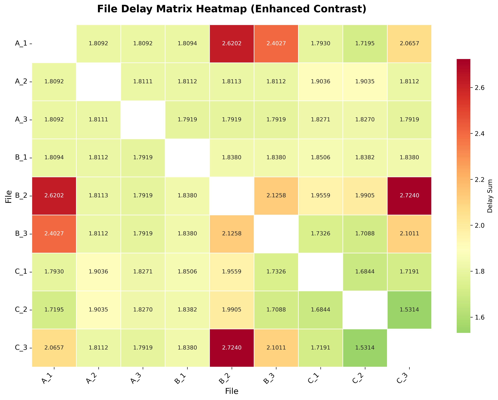
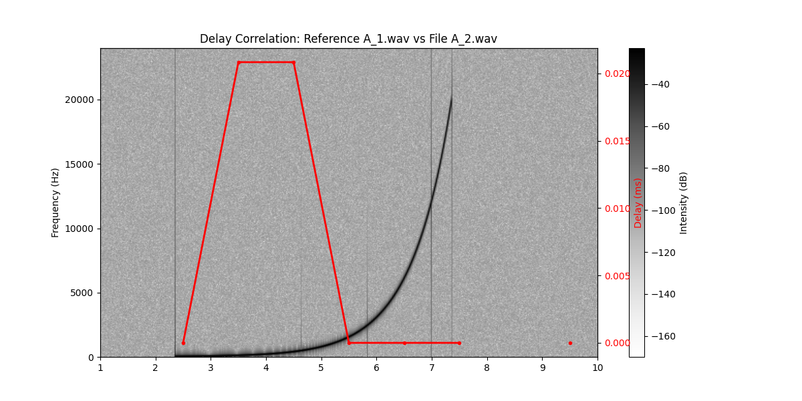
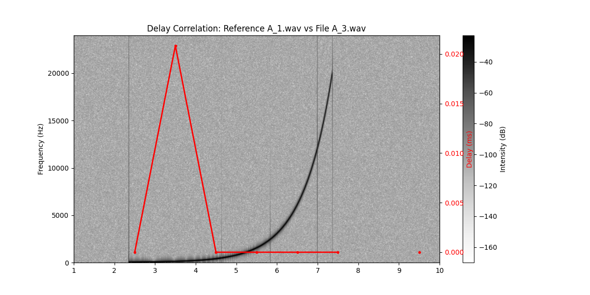

# Audio Delay Analysis Tool

这个项目用于分析多通道音频录制中由设备时钟偏移、触发延迟等引起的时间延迟问题。通过音量归一化和互相关方法对齐音频，并可视化延迟随时间的变化，帮助诊断多轨录音的同步误差。同时提供统计汇总与热力图可视化工具，便于快速识别整体延迟情况。

## 特性

- 自动扫描指定目录（及其子目录）下的所有 WAV 文件，校验采样率和声道数。
- 对音频进行音量归一化，消除音量差异对延迟计算的影响。
- 基于互相关的全局音频对齐，可生成对齐后的音频文件。
- 成对计算音频间的延迟，绘制延迟随时间变化的曲线（叠加在参考音频的频谱图上）。
- 包含模拟数据生成脚本，可生成带有随机起始时间、随机音量和模拟时钟偏移的扫频信号，便于测试。
- 提供延迟统计与可视化工具：计算每对音频的累积延迟并排序，生成热力图直观展示各音频文件间的整体延迟。

## 依赖

- 主要依赖包：`numpy`, `scipy`, `soundfile`, `pandas`, `matplotlib`, `seaborn`

可以使用 pip 一键安装：

```bash
pip install numpy scipy soundfile pandas matplotlib seaborn
```

## 快速开始

### 1. 生成模拟测试数据

运行 `audio_files_generate.py`，会在 `data/` 目录下生成三个分组（`group1`、`group2`、`group3`），每个分组包含三个带有扫频信号和底噪的 WAV 文件。

```bash
python audio_files_generate.py
```

生成的文件特点：
- 采样率 48 kHz，时长 10 秒，单声道。
- 扫频信号（20 Hz → 20 kHz，对数扫频）起始时间在 1~4 秒间随机。
- 扫频信号强度在 -5 dB ~ -3 dB 间随机。
- 每个文件独立添加强度为 -60 dB 的高斯白噪音。
- 可模拟随机延迟（代码中已添加少量采样点插入）。

### 2. 运行延迟分析

执行 `audio_files_analysis.py`，程序将：
- 扫描 `data/` 目录下的所有 WAV 文件。
- 校验采样率（默认 48 kHz）和声道数（默认取第 0 声道）。
- 进行音量归一化，使所有文件 RMS 统一为最大 RMS。
- 以第一个文件为参考，将所有文件对齐并保存到 `output/aligned_audio/`。
- 成对计算延迟，生成延迟‑时间曲线图，保存到 `output/figure/`。
- 将所有延迟数据汇总为 CSV 文件 `output/all_sequences.csv`。

```bash
python audio_files_analysis.py
```

### 3. 延迟统计分析

运行 `delay_analyze.py`，读取 `output/all_sequences.csv`，计算每个对比项（每对音频）的绝对延迟总和，并按总延迟从大到小排序。结果输出到终端，同时保存为 `output/delay_analysis_results.csv`。

```bash
python delay_analyze.py
```

### 4. 生成延迟热力图

运行 `delay_visualize.py`，读取 `output/delay_analysis_results.csv`，解析文件名构建对称矩阵，并绘制热力图。图片保存为 `output/delay_matrix_heatmap_optimized.png`，红色表示高延迟，绿色表示低延迟。

```bash
python delay_visualize.py
```

生成的热力图样式类似：



## 配置说明

在 `audio_files_analysis.py` 的 `Config` 类中可以调整以下参数：

- `data_path`：存放 WAV 文件的目录（默认 `"./data"`）。
- `sample_rate`：期望的采样率（默认 `48000`）。
- `channel`：要分析的声道索引（默认 `0`）。
- `output_dir`：输出目录（默认 `"./output"`）。
- `align_padding_samples`：对齐时参考文件前后填充的空白采样点数（默认 0.5 秒的采样数）。
- `limit_delay_ms`：延迟检测阈值（单位：毫秒），超过该值的延迟点会被标记为 NaN（默认 5.0 ms）。
- `too_low_db`：音量过低阈值（单位：dB），当窗口内 RMS 低于该值时忽略该窗口的延迟计算（默认 -60 dB）。

## 输出文件详解

执行分析后，`output/` 目录下会生成以下内容：

### `normalized_audio_volumes/`
音量归一化后的音频文件，文件名格式为 `MD5值-原文件名.wav`。若文件已存在则跳过处理。

### `aligned_audio/`
以第一个文件为参考对齐后的音频文件，文件名与原文件相同。

### `figure/`
每对文件的延迟图，命名格式如 `00_01_A_1.wav_vs_A_2.wav.png`。
图中背景为参考音频的频谱图（灰色），红色曲线表示待比较文件相对于参考文件的延迟（毫秒）。延迟超出 ±5 ms 的部分会视为无效，以避免极端值干扰。




### `all_sequences.csv`
CSV 文件，每一列对应一对音频的比较结果，每一行是每个时间窗口的延迟值（单位：毫秒）。可用于后续统计分析。

### `delay_analysis_results.csv`
由 `delay_analyze.py` 生成，包含每对音频文件的延迟总和（绝对值的累积），并按总延迟从大到小排序。便于识别延迟最大的音频对。

### `delay_matrix_heatmap_optimized.png`
由 `delay_visualize.py` 生成的热力图，以矩阵形式展示所有音频文件之间的总体延迟。颜色越红表示延迟越大，越绿表示延迟越小，对角线被屏蔽（自身对比无意义）。
